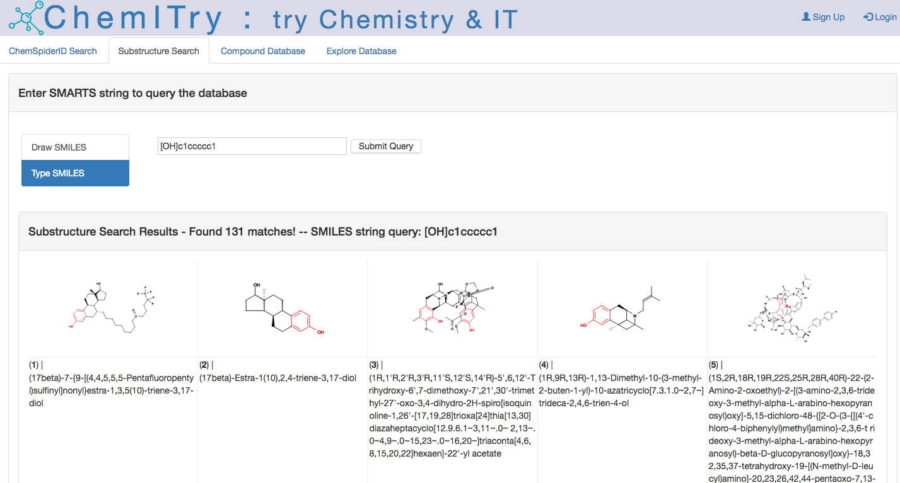

# chemITryFlask

A flask app that uses the cheminformatic tool, OpenBabel in the back-end to generate SVG images of chemical structures, generate a tanimoto similarity heatmap, euclidean network plot, PCA, and other exploratory data analysis visuals. Also includes a curated database of approved drug molecules that were web-scraped off of ChemSpider using a separate python script. The back-end SQL database used was MySQL. Applications in drug discovery, data analysis and de-replication of small molecules. 

###
Screenshot of dashboard and sub-substructure search results

